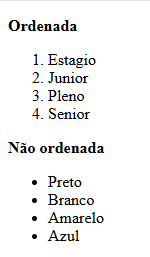

📘 Projeto Listas HTML

## 📷 Title

## 📷 Body

Projeto simples desenvolvido para praticar listas ordenadas e não ordenadas utilizando HTML5.

🚀 Tecnologias
HTML5
📚 Sobre o Projeto

O projeto apresenta exemplos de:

Listas Ordenadas (< ol >): utilizadas para itens que seguem uma sequência ou ordem específica.
Listas Não Ordenadas (< ul >): utilizadas para itens que não precisam seguir uma ordem definida.
🎯 Objetivo

Praticar a estruturação de conteúdo em páginas web utilizando listas no HTML.
